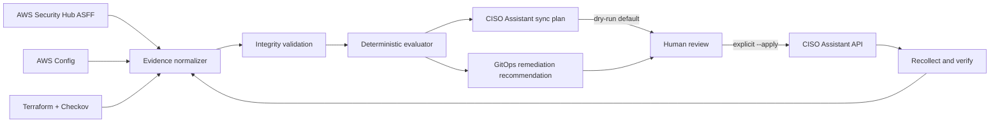

# CISO Assistant AWS Compliance Automation

An evidence and remediation bridge connecting AWS Security Hub, AWS Config and Infrastructure-as-Code scanners to CISO Assistant. It converts cloud posture signals into normalized, hash-verifiable evidence, deterministic control decisions and review-gated synchronization plans.

> This is the technical delivery layer between actual AWS state, compliance-as-code and the auditor's system of record—not another GRC dashboard.

## What this release proves

- AWS Security Finding Format normalization
- AWS Config compliance normalization
- Checkov/Terraform scan normalization
- Deterministic `satisfied`, `not_satisfied`, or `unknown` decisions
- Canonical SHA-256 evidence integrity and stable idempotency keys
- Explicit control mappings and advisory remediation
- Conservative CISO Assistant Evidence translation
- Dry-run by default; no autonomous AWS or infrastructure changes
- Offline validation requiring neither AWS nor CISO Assistant

Artifacts in [`evidence/reference`](evidence/reference) are generated from synthetic fixtures and are not represented as live AWS evidence.



## Run locally

Python 3.11+ is the only runtime requirement.

```bash
python3 -m venv .venv
source .venv/bin/activate
python -m pip install -e .

ca-aws-bridge normalize \
  --source security-hub \
  --input examples/security-hub-findings.json \
  --output generated/security-hub-evidence.json

ca-aws-bridge plan \
  --evidence generated/security-hub-evidence.json \
  --mappings config/control-mappings.json \
  --output generated/security-hub-sync-plan.json
```

Remote synchronization requires explicit operator intent and credentials:

```bash
export CISO_ASSISTANT_URL=https://ciso-assistant.example
export CISO_ASSISTANT_TOKEN=replace-me
ca-aws-bridge sync --plan generated/security-hub-sync-plan.json --apply
```

Run the complete reproducible lab:

```bash
bash scripts/validate.sh
```

## Safety and licensing

The bridge does not ingest AWS credentials, secret values or Terraform state. Production collection should use organization-level aggregation with read-only cross-account roles and customer-defined evidence redaction. LLM output may assist explanation but cannot determine control status.

This independent API client is MIT licensed and imports no CISO Assistant source. CISO Assistant and standards content remain subject to their respective licenses. See [architecture](docs/ARCHITECTURE.md), [mapping policy](docs/CONTROL-MAPPINGS.md), and [production roadmap](docs/PRODUCTION-ROADMAP.md).

Need AWS multi-account evidence automation, compliance-as-code or an enterprise control-plane integration? [Request an A2Z SOC architecture engagement](https://a2zsoc.com/contact?topic=ciso-assistant-aws-compliance-automation&utm_source=github&utm_medium=repository).
